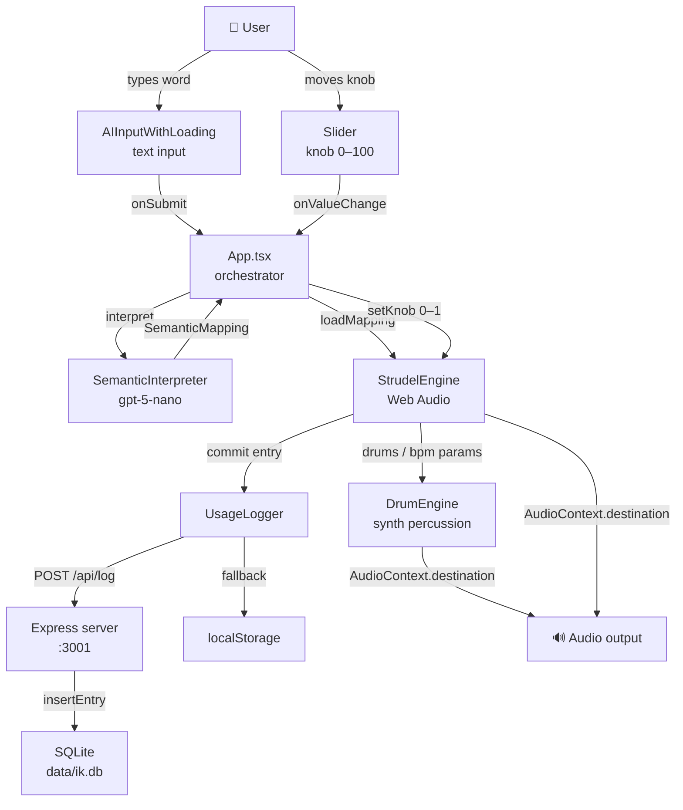
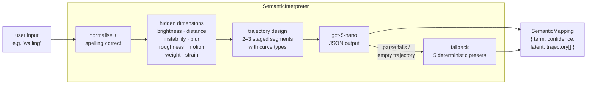
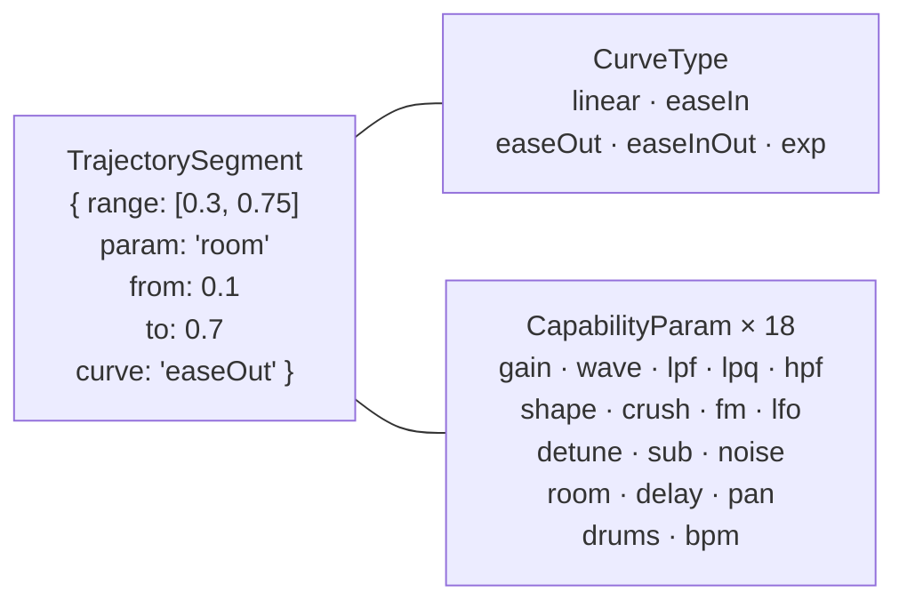
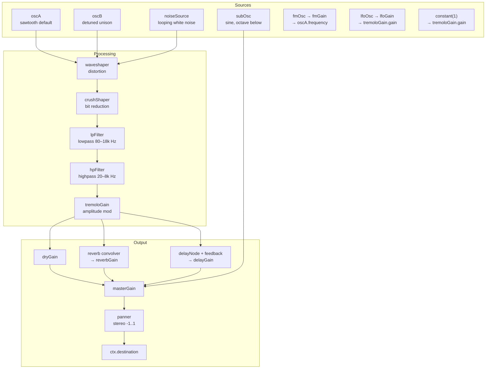
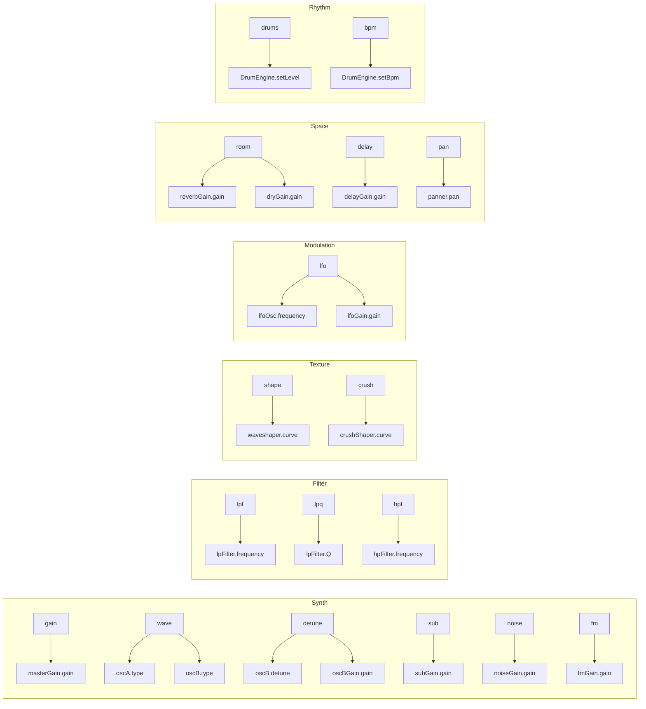
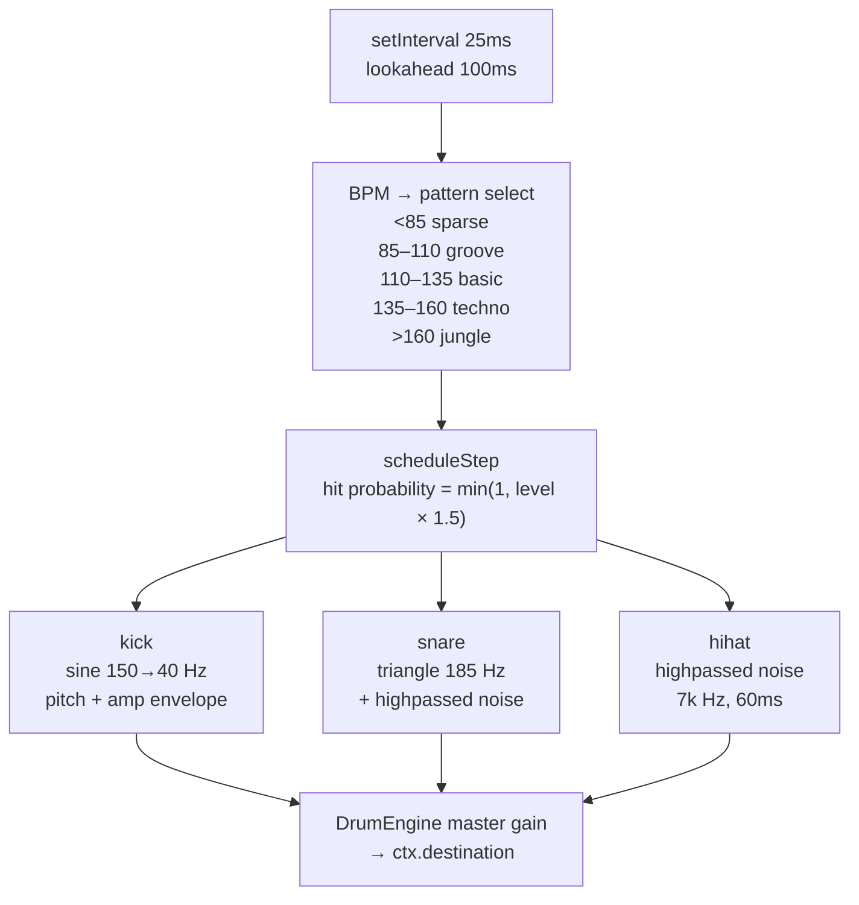
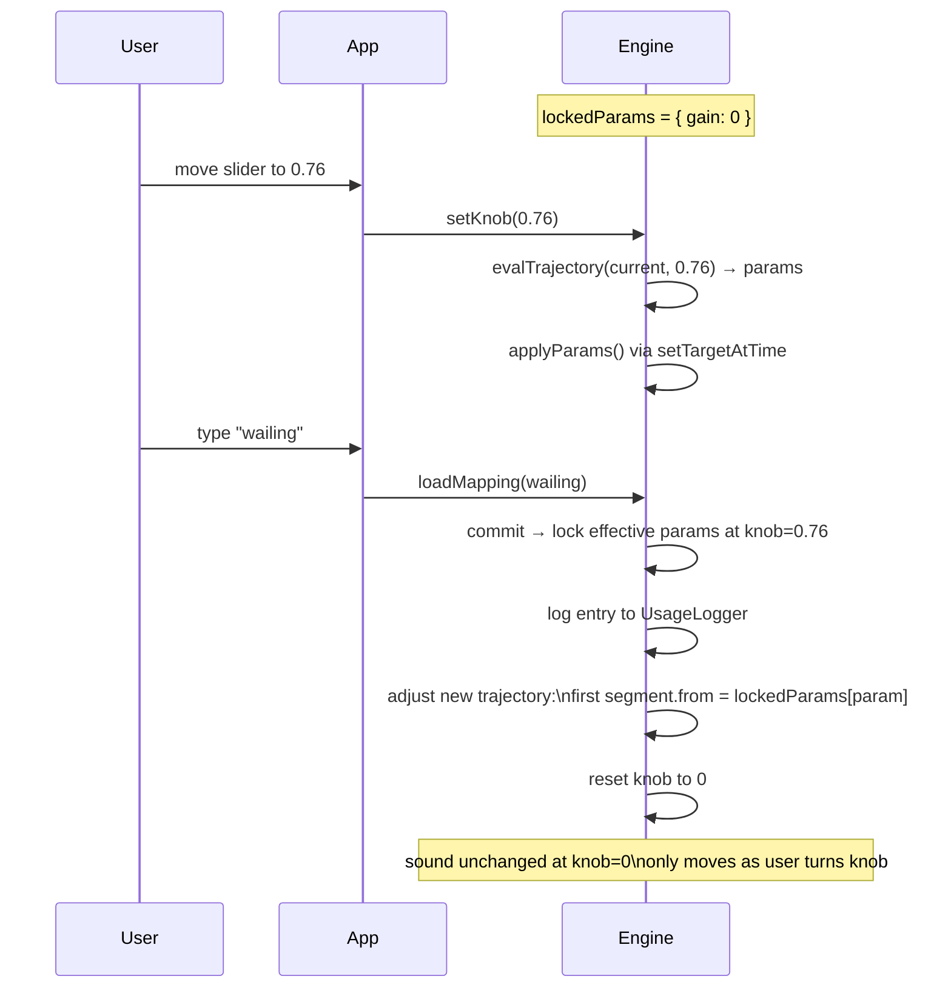
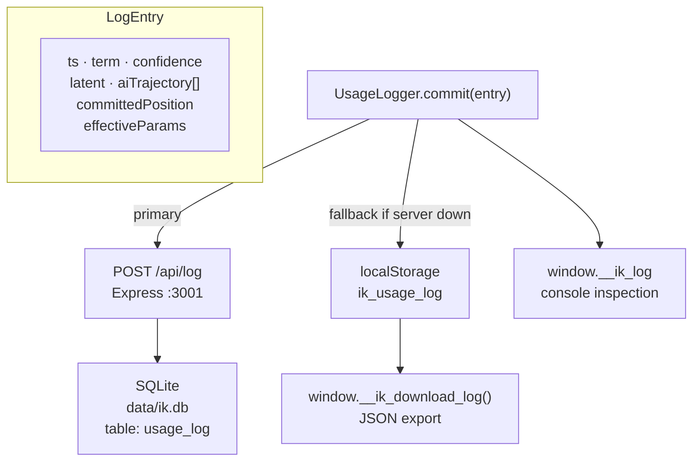
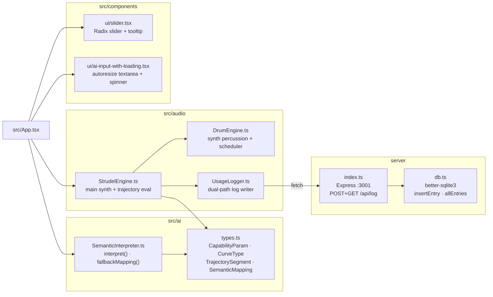
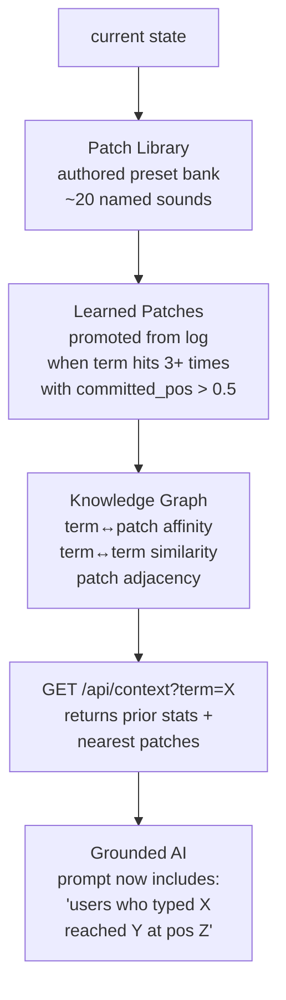

# Infinite Knob — Architecture

A semantic audio instrument. Type a word, move the knob, hear the word become sound.

---

## System Overview

---

## AI Interpretation Pipeline

### Trajectory segment shape

---

## Audio Engine

### Parameter → node mapping

---

## Drum Engine

---

## Continuity + Additive Layering

---

## Logging + Persistence

---

## File Map

---

## What's planned next

