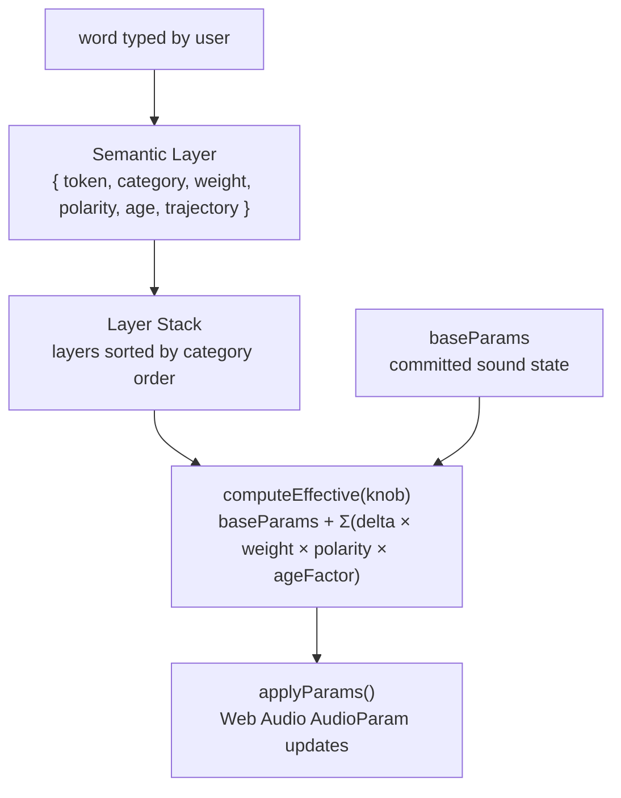
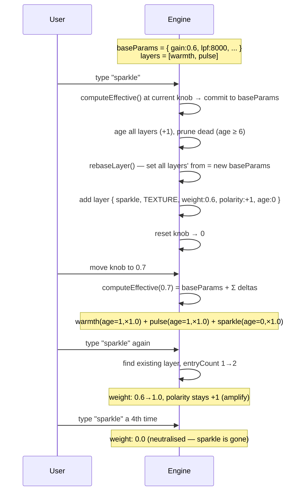
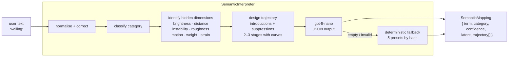
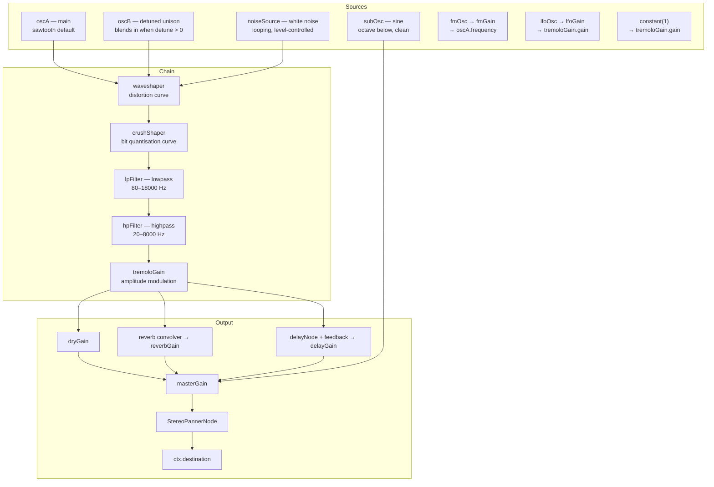

# Infinite Knob — Build Specification

> One sound. One knob. Words transform it.

---

## What this is

A single synthesised tone that evolves to embody whatever the user types. Not a sampler. Not an instrument selector. One continuous sound whose **character** is shaped by language.

- Type `sparkle` → the sound becomes sparkle-like: bright, crystalline, quick, a little unstable
- Type `bruised` → the sound becomes bruised-like: darkened, hollow, softened at the edges
- Type `vast` → the sound opens into distance and space
- Type `sparkle` again → it amplifies, then a third time it softens, a fourth time it neutralises, a fifth time it inverts — the sound moves *away* from sparkle

The knob is not a volume control. It is an intensity control over the current semantic transformation. At 0: the sound is what it was. At 1: the sound has fully become the word.

---

## Core model



### baseParams

The committed sound state. This is what the sound IS at knob = 0. Updated every time a new word is submitted — the effective state at the current knob position gets baked in.

### layers[]

Active semantic transformations. Each word adds or updates a layer. Layers accumulate — they do not replace each other. The knob controls the intensity of the **entire stack** simultaneously.

### Trajectory evaluation

Each layer holds a trajectory: an array of segments that describe how each audio parameter changes as the knob moves from 0 to 1.

```
delta[param] = (evalTrajectory(layer, knob)[param] − baseParams[param]) × effectiveWeight
output[param] = baseParams[param] + Σ delta[param]
```

At knob = 0, every layer's delta is always 0 (because each trajectory's first segment `from` is set to `baseParams[param]` on creation). The sound never jumps when a new word is typed.

---

## Semantic layer lifecycle



### Polarity cycle

Each time the same word is typed, it advances through the cycle:

| Entry | Weight | Polarity | Effect |
|-------|--------|----------|--------|
| 1st   | 0.6    | +1       | gentle introduction |
| 2nd   | 1.0    | +1       | full amplification |
| 3rd   | 0.6    | +1       | softening |
| 4th   | 0.0    | +1       | neutralised |
| 5th   | 0.6    | -1       | gentle inversion |
| 6th   | 1.0    | -1       | full inversion |
| 7th   | 0.6    | -1       | softening inversion |
| 8th   | 0.0    | +1       | back to neutral, cycle resets |

Polarity = -1 inverts the delta: a trajectory that moved toward brightness now moves toward darkness by the same amount.

### Age-based forgetting

Every time a new word is submitted, all existing layers age by 1. The age factor degrades their effective contribution:

| Age | Factor |
|-----|--------|
| 0–2 | 1.0 (full weight) |
| 3   | 0.75 |
| 4   | 0.40 |
| 5   | 0.10 |
| 6+  | 0 (removed) |

This is silent and gradual. The user never hears a sudden cut.

### Category processing order

Layers are sorted by category before their deltas are summed. Later categories apply on top of earlier ones, so rhythm and core tone establish first and mood lands last.

```
STRUCTURE → TIMBRE → TEXTURE → MOTION → EMOTION → SPACE
```

| Category  | What it shapes |
|-----------|----------------|
| STRUCTURE | Transient character, attack/decay quality, punch, weight |
| TIMBRE    | Core tone — brightness, warmth, waveform, fundamental colour |
| TEXTURE   | Surface — grain, noise, roughness, crystal, digital character |
| MOTION    | Movement — tremolo, vibrato, drift, oscillation rate |
| EMOTION   | Felt quality — tension, sadness, dread, tenderness |
| SPACE     | Spatial character — distance, roominess, width, depth |

---

## AI pipeline



### The transformation rule

The AI must answer two questions for every word:
1. What qualities does the sound **gain** to become this word?
2. What qualities does the sound **lose** that would contradict this word?

Both are encoded as trajectory segments. `sparkle` introduces brightness and shimmer **and** suppresses sub weight and reverb. `punchy` introduces tightness and sub **and** removes room and delay tail.

### Trajectory segment

```typescript
interface TrajectorySegment {
  range: [number, number]  // [knobStart, knobEnd] both 0–1
  param: CapabilityParam
  from: number             // overwritten to baseParams[param] on layer creation
  to: number               // the target value at range end
  curve: CurveType         // linear | easeIn | easeOut | easeInOut | exp
}
```

Segments for different params may share the same range. Segments for the same param must not overlap.

### Curve types

| Curve | Shape | Use for |
|-------|-------|---------|
| linear | constant rate | neutral change |
| easeIn | slow start, fast end | building, arriving |
| easeOut | fast start, slow end | releasing, settling |
| easeInOut | slow–fast–slow | smooth transformation |
| exp | near-flat then sudden | eruption, strain, breaking point |

---

## Audio engine

### Signal chain



All parameter updates use `AudioParam.setTargetAtTime(value, now, 0.012)` — 12ms time constant, sub-5ms perceived latency, no clicks.

### Parameters

| Param   | Range        | Node target |
|---------|-------------|-------------|
| gain    | 0–1.5       | masterGain.gain |
| wave    | 0–3 (int)   | oscA.type + oscB.type (0=saw, 1=square, 2=tri, 3=sine) |
| lpf     | 80–18000 Hz | lpFilter.frequency |
| lpq     | 0–20        | lpFilter.Q |
| hpf     | 20–8000 Hz  | hpFilter.frequency |
| shape   | 0–1         | waveshaper.curve (distortion amount × 500) |
| crush   | 0–1         | crushShaper.curve (bit depth 16→1) |
| fm      | 0–1         | fmGain.gain (× 30) |
| lfo     | 0–12 Hz     | lfoOsc.frequency + lfoGain.gain |
| detune  | 0–200 cents | oscB.detune + oscBGain.gain |
| sub     | 0–1         | subGain.gain |
| noise   | 0–1         | noiseGain.gain (× 0.3) |
| room    | 0–1         | reverbGain.gain (× 0.8), dryGain.gain (1 − wet × 0.45) |
| delay   | 0–0.8       | delayGain.gain |
| pan     | -1–1        | panner.pan |

### Default params (initial baseParams)

```
gain:0  wave:0  lpf:10000  lpq:1  hpf:20
shape:0  crush:0  fm:0  lfo:0  detune:0
sub:0  noise:0  room:0  delay:0  pan:0
```

### Bootstrap

On `init()`, a single volume layer is added to the stack:
```
{ token:'volume', category:'TIMBRE', weight:1.0, polarity:+1,
  trajectory: [{ range:[0,1], param:'gain', from:0, to:0.8 }] }
```
This makes the initial slider a gain control before any word is typed. On first word submission, this layer's effect is committed to `baseParams.gain` and the layer begins aging normally.

---

## Logging

Every word submission logs the current state to SQLite via a local Express server (port 3001). Falls back to `localStorage` if server is unavailable.

```typescript
interface LogEntry {
  timestamp: string
  term: string
  confidence: number
  latent?: Record<string, number>
  aiTrajectory: TrajectorySegment[]
  committedPosition: number          // knob position at time of submission (0–1)
  effectiveParams: Record<string, number>
  layerStack: {
    token: string
    category: string
    weight: number
    polarity: number
    age: number
  }[]
}
```

### SQLite schema

```sql
CREATE TABLE usage_log (
  id               INTEGER PRIMARY KEY AUTOINCREMENT,
  ts               TEXT NOT NULL,
  term             TEXT NOT NULL,
  confidence       REAL NOT NULL,
  latent           TEXT,
  ai_trajectory    TEXT NOT NULL,
  committed_pos    REAL NOT NULL,
  effective_params TEXT NOT NULL,
  layer_stack      TEXT NOT NULL
)
```

### Console access

```js
window.__ik_log           // live array of all entries (this session)
window.__ik_download_log()  // download full log as JSON
```

---

## UI

Pure white. Minimal. Nothing visible except three elements:

```
          infinite knob

    ────────────────────●────

    [  describe the sound   ]
```

- Title: large, light weight, tracked
- Slider: full-width, max 384px, resets to 0 on each word submission
- Text input: auto-resizing textarea, submits on Enter, shows loading state while AI processes
- No labels. No status text. No descriptions displayed. Nothing else.

---

## Tech stack

| Layer | Choice |
|-------|--------|
| Frontend | React 18 + TypeScript + Vite |
| Styling | Tailwind CSS v3 + CSS variables |
| UI primitives | Radix UI (Slider, Tooltip) |
| Audio | Web Audio API (no samples, no Strudel runtime) |
| AI | OpenAI gpt-5-nano, `response_format: json_object`, temp 0.8 |
| Backend | Express + better-sqlite3 |
| Dev runner | tsx + concurrently |
| Path alias | `@/` → `./src/` |

---

## What comes next

### Patch library

A named library of authored sound states — the instrument's "presets". Not patches that play back, but target parameter configurations that the AI can aim trajectories toward.

Each patch is a named set of `effectiveParams`. Examples: `warm-pad`, `hollow-flute`, `cathedral`, `digital-ruin`, `nasal-cry`, `supersaw`.

### Knowledge graph

Built from the usage log. Connects:
- **term nodes** → average effective params, average committed position, hit count
- **patch nodes** → named target states
- **term → patch edges** → affinity (how closely this term's typical outcome matches this patch)
- **term → term edges** → semantic similarity (cosine distance on latent dimensions)

### Grounded AI

Before calling GPT, fetch `/api/context?term=X`. If prior usage exists, inject into the prompt:

> *"Users who typed 'wailing' typically reached `{lpf:1800, lpq:12, room:0.6}` at knob position 0.72. Nearest patch: nasal-cry."*

The AI designs trajectories toward proven destinations rather than inventing from scratch.

### Self-rewriting patches

When a term appears 3+ times with average `committedPosition > 0.5` and low variance in `effectiveParams`, it crystallises into a learned patch automatically. The instrument writes its own vocabulary from use.
